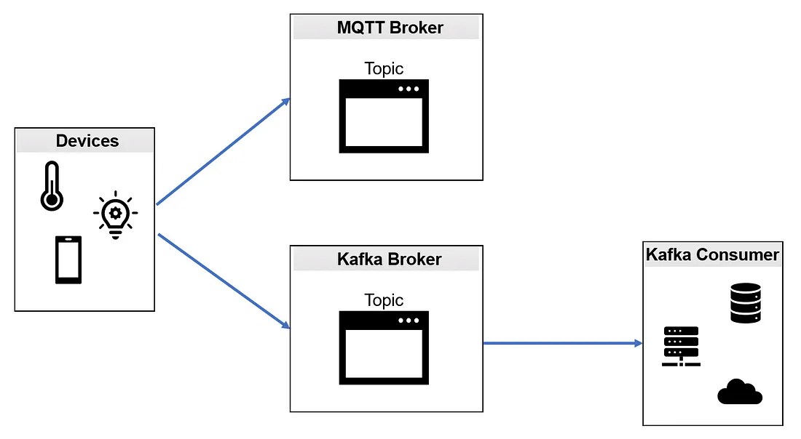

# Teste-Kafka-MQTT-Option1
Teste de comunicação de um Dispositivo IoT simulado enviando a mesma mensagem ao mesmo tempo para o broker Kafka e broker MQTT (Opção 1).

Baseado nas instruções de https://medium.com/python-point/mqtt-and-kafka-8e470eff606b.

    

